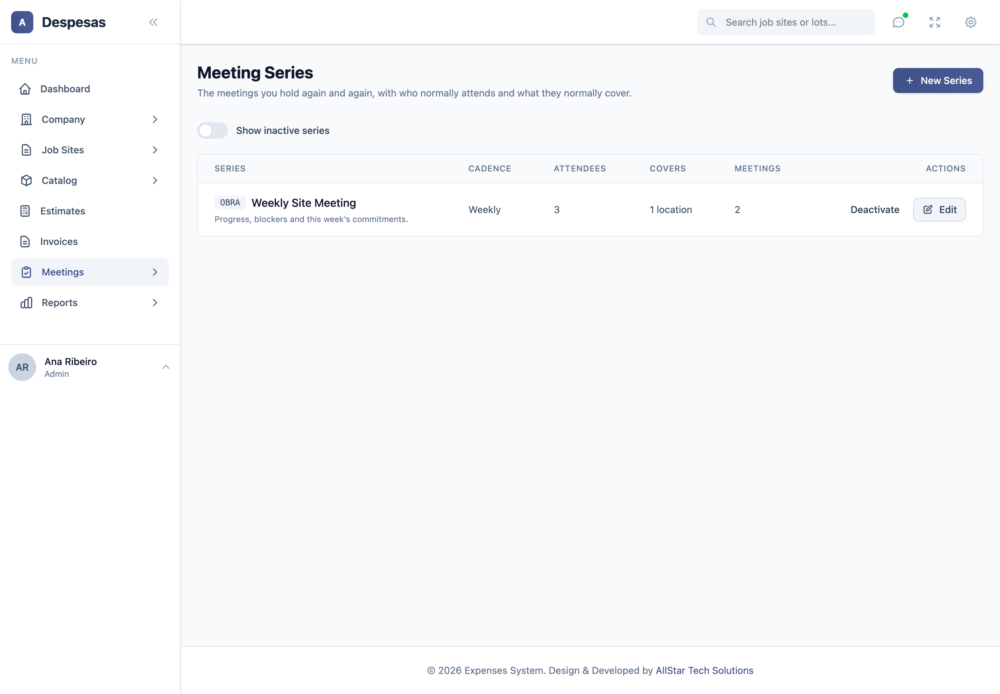
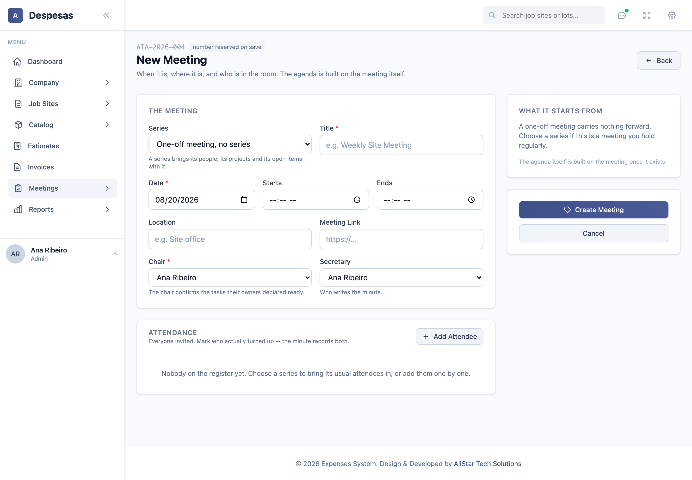
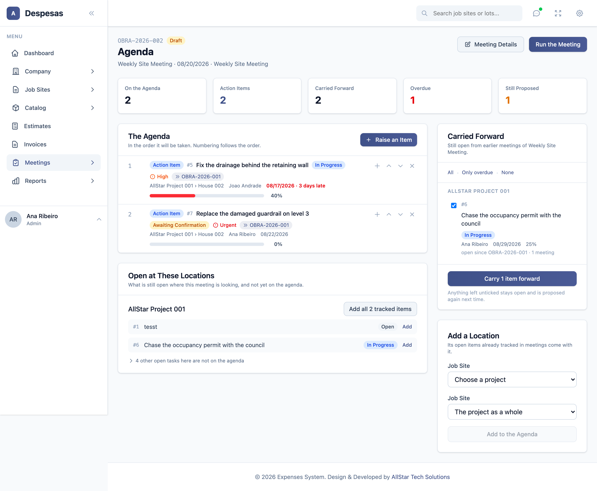
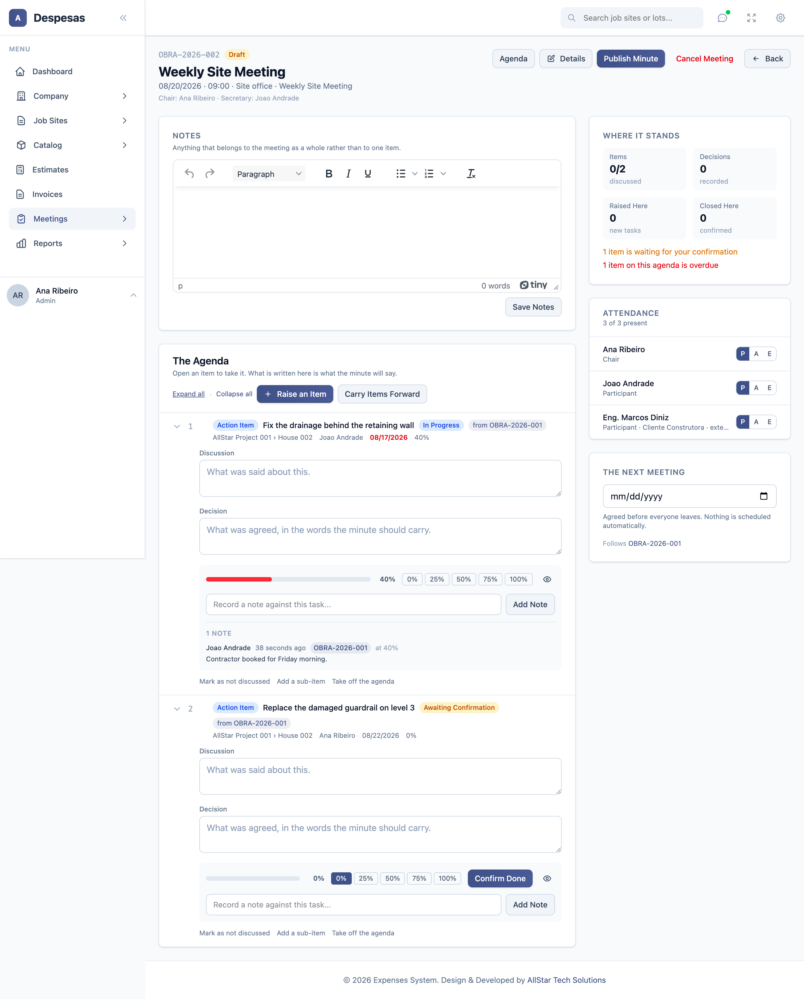
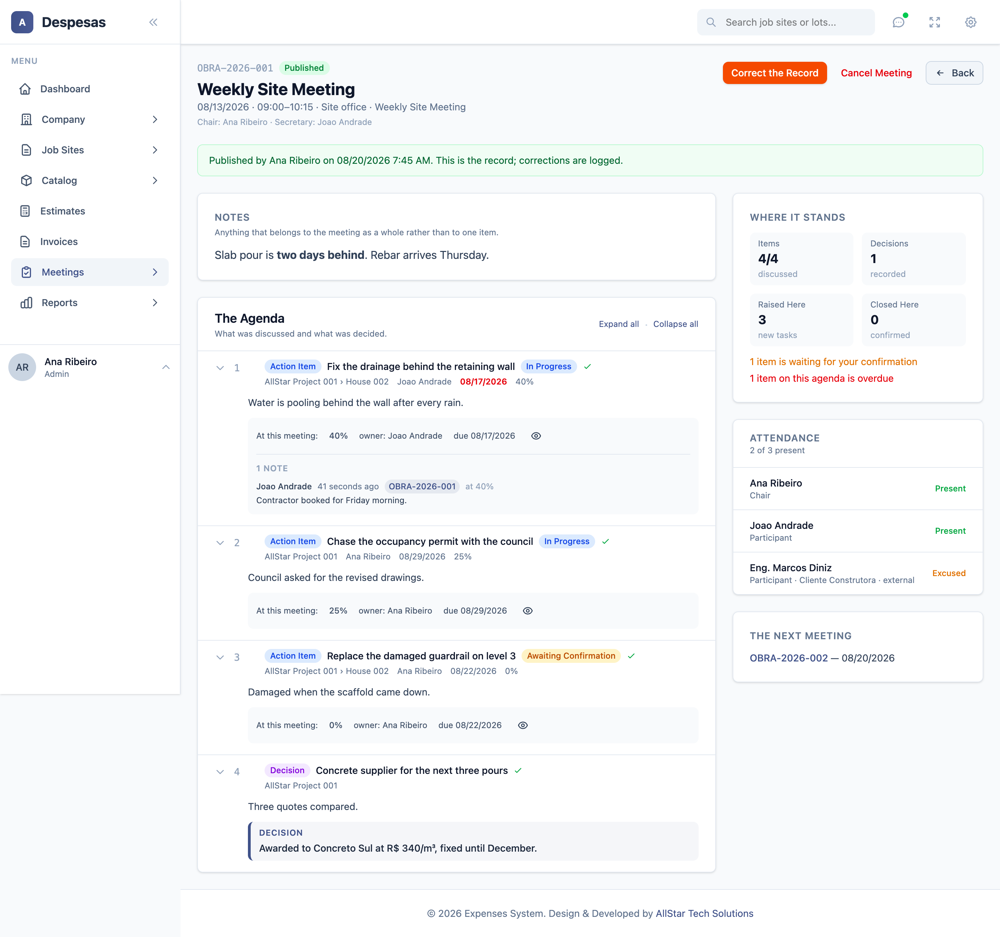
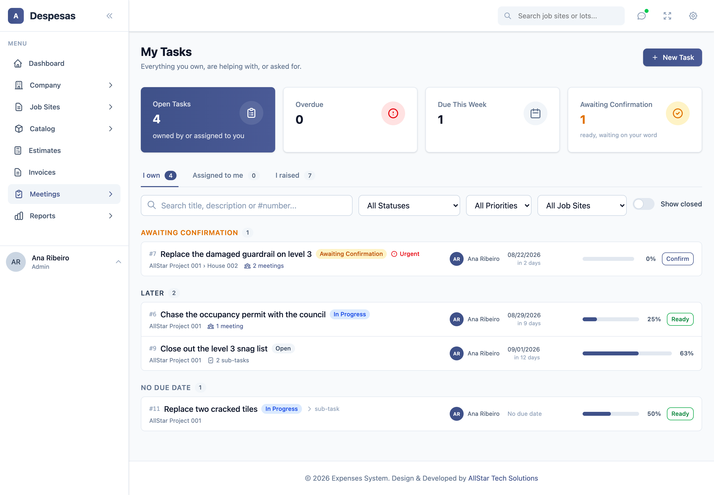
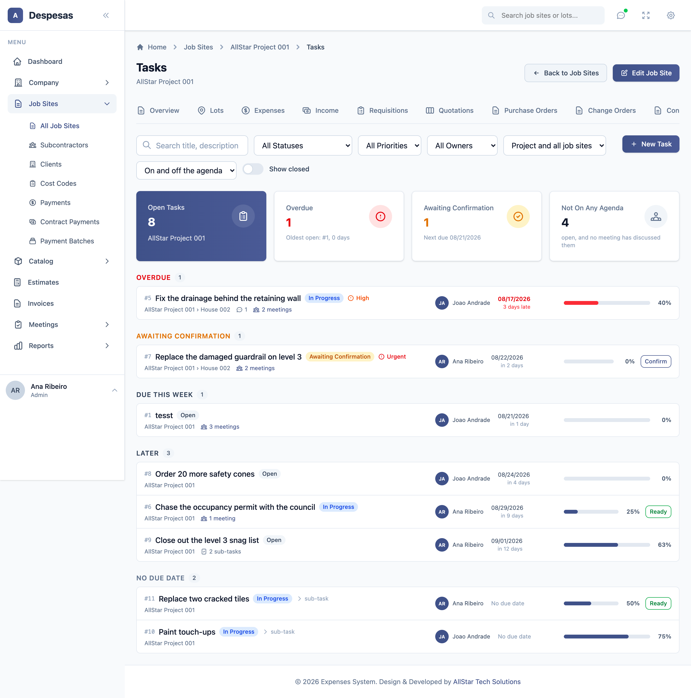
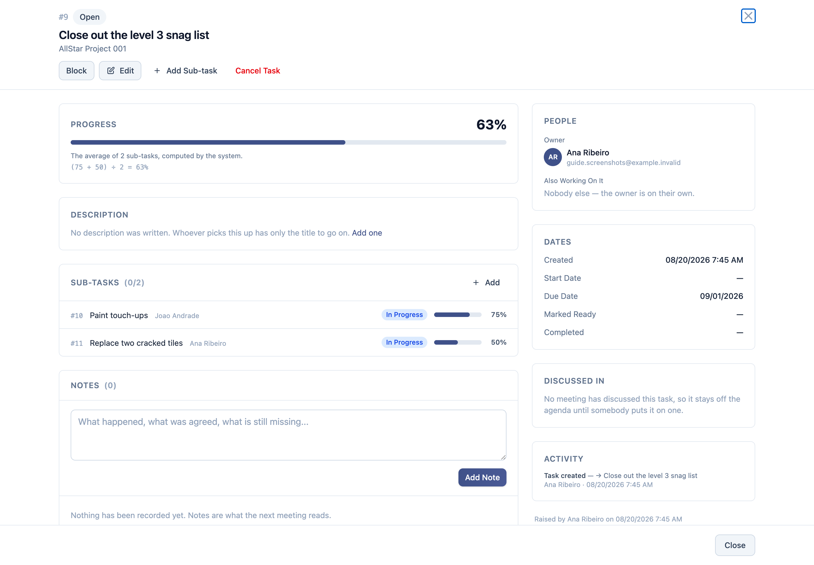

# Meetings, Minutes and Tasks — How to Use It

A guide for the people who will run the meetings, not for whoever maintains the code.
Written 2026-08-20. Screenshots are from a real install with demo data.

> **A note on wording.** In the English interface this install calls a *project* a **"Job Site"**
> (that renaming lives in `lang/en.json`). So where this guide says *project*, the screen says
> *Job Site*. In pt_BR the screens say **Projeto** and **Local**. One place still shows the word
> twice for two different things — the *Add a Location* panel — and that is a known wording issue,
> not two identical fields.

---

## 1. The one thing to understand first

The module has four words that sound similar. They are four **stages of the same thing**, not four
different features:

| Word | What it is | When it exists |
|---|---|---|
| **Series** | A meeting that repeats — "Weekly Site Meeting". Set up once. | Forever |
| **Meeting** | One date. Created inside a series. | From when you create it |
| **Agenda** | The list of what that meeting will cover. | While the meeting is a **draft** |
| **Minute (ata)** | The record of what was said and decided at it. | After you press **Publish** |

**The agenda and the minute are the same meeting at two different moments.** You do not create a
minute. You build an agenda, run the meeting on top of it, and publishing turns it into the minute.

And underneath all four:

| Word | What it is |
|---|---|
| **Task** | A piece of work with one owner and a date. It **outlives the meeting** and keeps coming back until it is closed. |

That last line is the whole point of the module. An action item raised in June is not copied into
July's minute — it is the *same task*, appearing again, with its progress and its history intact.

---

## 2. The flow, end to end

```
 Series  ──▶  Meeting  ──▶  Agenda  ──▶  Run it  ──▶  Publish  ──▶  Minute
 (once)      (each week)   (before)     (during)      (at the end)   (the record)
                                │                                        │
                                └───── tasks are raised and worked ──────┘
                                              │
                                    still open? ──▶ proposed on the next agenda
```

---

## 3. One-time setup: create the series

**Meetings → Meeting Series → New Series.** Manager or admin only.



You are telling the system three things:

1. **The code** (`OBRA`) — it becomes part of every minute number this series ever issues:
   `OBRA-2026-001`, `OBRA-2026-002`.
2. **The usual attendees** — copied onto every new meeting so nobody retypes the register each
   week. People outside the company are added by name, company and e-mail; they never need a login.
3. **The projects it covers** — a new meeting starts pointing at these, which is how their open
   items appear on the agenda without anybody asking.

> **Why a series matters.** Carry-forward is read *within a series*. Without one, the open items of
> your site meeting would mix with those of the directors' meeting. A one-off meeting is allowed,
> but it carries nothing forward on its own.

A series that has already held meetings **cannot be deleted**, only deactivated — its minutes are
part of the record.

---

## 4. Before the meeting: create it

**Meetings → New Meeting.**



Choose the series and the form fills itself: title, location, the whole attendance register, and —
once the series has met before — the next date from its cadence. Set the chair (the person who will
confirm finished work) and, if you want, a secretary.

The number shown at the top is the number this meeting *will* get; it is reserved the moment you
save, so two people creating a meeting at once cannot take the same one.

The right-hand panel tells you what this meeting will start from: the previous meeting in the
series and **how many open action items will carry forward**.

---

## 5. Before the meeting: build the agenda

**On the meeting row, press Agenda.** This is where the module earns its keep.



There are exactly **three ways** something gets onto an agenda.

### a. Carry-forward — automatic

The right-hand panel lists everything **still open from earlier meetings of this series**, already
ticked. Each row shows the owner, the due date (red, with the days late), the progress, and
**"open since OBRA-2026-001 · 3 meetings"** — how long it has been dragging. The last note written
on it is quoted underneath.

- **All / Only overdue / None** are shortcuts. "Only overdue" is the usual short agenda.
- Press **Carry N items forward** and they join the agenda.
- **Anything left unticked stays open.** It is not closed and not lost — it is simply not on
  *this* agenda, and it will be proposed again next time.

### b. Add a location — brings its open items with it

Pick a project (and optionally one job site) and press **Add to the Agenda**. Every open task at
that location **that meetings already track** comes with it.

Underneath, per location, you will see a line like *"4 other open tasks here are not on the
agenda"*. Those are tasks somebody raised on a project page that **no meeting has ever discussed**.
They stay off the minute unless you deliberately press **Add** on one — and from that moment they
carry forward like everything else.

> **This is the rule that surprises people.** A task raised on a project page is somebody's own
> work. It does not appear in your minutes unless you put it there. The drawer exists so you can
> *see* that it exists without it filling up the record.

### c. Raise an item — something new

**Raise an Item** adds a line: *Information*, *Decision* or *Action Item*.

An **Action Item** creates a task then and there, and demands an **owner and a due date**. From
that moment it is tracked and will carry forward on its own.

Lines can be reordered with the arrows, given sub-items with **+**, and taken off with **×**.
Taking a line off the agenda **never closes its task**.

---

## 6. During the meeting: run it

**Press Run the Meeting** (or open the meeting from the list).



The agenda is an **accordion**: each line is collapsed to a header showing who owns it, when it is
due, the percentage, and a green tick once something has been written. **Open one line at a time**
as you take it, or use *Expand all*.

Inside an open item you can:

- write the **Discussion** — what was said;
- write the **Decision** — what was agreed (it prints in a box on the minute);
- move the task's **progress** with the 0/25/50/75/100 buttons;
- **Confirm Done** if you are the chair and the owner has marked it ready;
- **record a note** against that task — it is stamped with this meeting, so the task screen later
  reads "said at OBRA-2026-001";
- read the **notes already recorded** on that task, without leaving the meeting;
- press the **eye** to open the full task.

Also on this screen:

- **Notes** at the top is a rich-text box for anything about the meeting as a whole.
- **Attendance** on the right: mark each person **P / A / E** (present, absent, excused) as the
  room fills.
- **Where It Stands** counts items discussed, decisions recorded, tasks raised here and closed
  here, and warns you about what is overdue or waiting on your word.
- **Raise an Item** works here too — things come up mid-meeting.
- An item nobody reached: **Mark as not discussed**. It rolls to the next meeting untouched.

Everything saves as you type. Nothing needs a "save" press except the Notes box.

---

## 7. At the end: publish

**Publish Minute.** The system checks two things first and will refuse:

- the agenda is not empty;
- **every action item has an owner and a due date** — the dialog names the offending lines.

Publishing does four things:

1. **Locks the minute.** It stops being editable.
2. **Photographs every task** as it stands today. If a task is at 50% now and reaches 90% next
   week, this minute still says 50% — with *"since then it has moved on"* beside it.
3. Records who published it and when.
4. Lets you set the **next meeting date**.



The published minute opens with every item expanded, because a record is read as a document.

### Creating the next meeting

**Create the Next Meeting** builds the follow-up as a draft, copies the register, links the two
meetings both ways, and **arrives with everything still open already on its agenda**. You are back
at step 5 with most of the work done.

### If the minute is wrong

**Correct the Record** — admin only. You must type *why* **before** anything unlocks. Your changes
are saved with the old text kept alongside, and the minute grows a **Corrections** section showing
what it used to say. Nothing changes silently.

---

## 8. Tasks, away from meetings

Tasks are not only a meetings thing.

**Meetings → My Tasks** is what one person is on the hook for, in three tabs — **I own**,
**Assigned to me**, **I raised** — grouped by overdue, awaiting confirmation, due this week, later.



Every project and job site also has a **Tasks** page, and both overview pages carry an **Open
Action Items** card.



The filter worth knowing on those pages is **"On and off the agenda"**: it answers *"what is open
here that no meeting has ever discussed?"*

### The task itself



Everything the record knows: progress (with the arithmetic printed when it comes from sub-tasks),
description, sub-tasks, the notes timeline, files, **every meeting that discussed it**, and the
full activity log.

---

## 9. The rules that catch people out

| Rule | Why |
|---|---|
| **Only the owner can mark a task Ready.** Not a manager, not an admin. | It is a statement about their own work. An admin who must force it changes the owner first, which is logged. |
| **Ready is not Done.** The chair (or an admin/manager) confirms it. | Items get closed in front of everyone, usually at the meeting. |
| **100% does not close a task.** | Reaching 100% is progress; declaring it finished is the owner's call. |
| **A task with sub-tasks has no percentage of its own** — it is the average of its children, computed by the system. | So the number on screen is never a guess somebody typed. |
| **You cannot mark a task ready while a sub-task is open.** | |
| **Removing a line from an agenda does not close its task.** | It means "not discussing this today". |
| **Cancelling a meeting closes nothing.** | Its items stay open and appear at the next one. |
| **Tasks raised outside a meeting never reach an agenda by themselves.** | The minute is what management committed to, not everyone's to-do list. |
| **Overdue counts even when Ready.** | Otherwise a task parks in "ready" forever and the report looks healthy. |

---

## 10. Who can do what

| Action | Who |
|---|---|
| See meetings and minutes | anyone signed in |
| Create a task, add notes and files, move progress | anyone signed in |
| **Mark a task Ready** | **its owner, and nobody else** |
| Confirm completion / reopen | the chair of the meeting it came from, admin, manager |
| Create meetings, build agendas, run and publish | admin, manager (publishing also the chair) |
| Manage series | admin, manager |
| Correct a published minute | **admin only**, with a reason |

The whole module can be switched off for an install in **System Settings → Modules**; the sidebar
entry, the project tabs and the overview cards all disappear with it.

---

## 11. If something looks wrong

| What you see | What it means |
|---|---|
| An open item did not appear on the new agenda | It has never been discussed in a meeting of *this* series. Add its location, then use the "not on the agenda" drawer. |
| "Publish" is greyed out or refuses | An action item has no owner or no date — the dialog names it. |
| The minute shows an old percentage | That is deliberate. It shows what was true at that meeting. |
| An item cannot be marked ready | It has open sub-tasks, or you are not its owner. The screen says which. |
| A published minute cannot be edited | Use **Correct the Record** (admin). |
| Two dropdowns both say "Job Site" | Known wording issue — the first is the project, the second is the job site within it. |

---

## 12. What is not built yet

As of 2026-08-20 the module does **not** yet:

- produce a **PDF of the minute** or e-mail it to attendees;
- send any **notification** — assignment, closure, overdue or the weekly digest;
- show a dashboard widget, an all-tasks list or reports.

Those are phases 6–8 in `docs/meetings-module-plan.md`.
